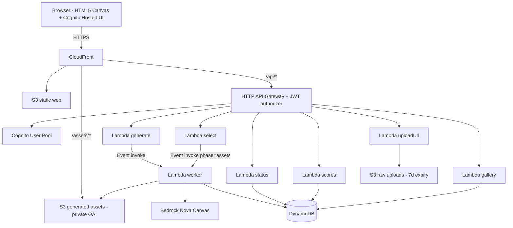

# Architecture

## Overview

Photo Horde Survivor is a fully serverless web game. A player's photo is turned into
game assets by **AWS Bedrock Nova Canvas**, and gameplay runs entirely in the browser
on an HTML5 canvas. Everything is provisioned with **AWS CDK** (TypeScript).

## Components

### Frontend (`frontend/`)
Vanilla ES modules, no build step.
- `config.js` — loads `/config.json` (deployed by CDK) with query-param overrides for local dev.
- `auth.js` — Cognito Hosted UI (implicit grant). The **ID token** (`aud` = app client id)
  is stored in `sessionStorage` and sent as `Authorization: Bearer`.
- `api.js` — fetch wrapper; presigned-upload helper; status polling.
- `logic.js` — pure game math (spawn, collision, scoring, difficulty) — unit tested.
- `flow.js` — pure polling/selection state-machine predicates — unit tested.
- `game.js` — canvas engine (input, loop, render) built on `logic.js`.
- `main.js` — UI orchestration and the upload → generate → poll → select → play flow.

### Backend (`backend/`)
Node 20 ESM Lambda handlers + a shared layer.
- `shared/common.mjs` — AWS clients (Bedrock client `requestTimeout` = 300s), CORS/HTTP
  helpers, `getUser()` from JWT claims, env.
- `shared/nova.mjs` — Nova Canvas wrapper: prompt building, `IMAGE_VARIATION`,
  `BACKGROUND_REMOVAL`, response parsing (handles RAI drops / empty results).
- `shared/data.mjs` — DynamoDB data access (generations, scores, quota).
- `shared/storage.mjs` — S3 presign + read/write + upload validation.
- `handlers/` — `health`, `uploadUrl`, `generate`, `worker`, `status`, `select`,
  `scores`, `gallery`.

### Infrastructure (`infra/`)
A single CDK stack (`GameStack`).

## Data model (DynamoDB)

| Table         | Key                       | Notes |
|---------------|---------------------------|-------|
| Generations   | PK `generationId`         | owner sub, `steps[]` narration, `variants[]`, `selectedVariantId` (selection lock), `assetPack`, `status`, `ttl`. GSI **gallery-index** (`galleryPublic` = `Y`, sort `completedAt`) for the opt-in gallery. |
| Scores        | PK `board`, SK `scoreId`  | GSI **score-index** (`board`, numeric `score`) → top-N descending. |
| Quota         | PK `pk` = `sub#YYYY-MM-DD` | atomic `count`, `ttl` (~2 days). |

## Key flows

### Generation (hero phase)
1. `POST /generate` → `incrementQuota` (atomic, conditional on staying under limit),
   create record, **async** invoke worker (`InvocationType: Event`), return `202` + `generationId`.
2. Worker writes ordered steps, calls `IMAGE_VARIATION` ×3 styles, `BACKGROUND_REMOVAL`,
   stores sprites in the assets bucket, then `setVariants` + status `READY`.
3. Frontend polls `GET /generate/{id}/status` (owner-only), renders narration and the
   3 presigned hero previews.

### Selection (assets phase) — single selection
1. `POST /select` performs a conditional `UpdateItem`
   (`attribute_not_exists(selectedVariantId) AND ownerSub = :sub`). Repeat → `409`.
2. On success it **async** invokes the worker with `phase=assets`, which generates the
   enemy/bullet (background-removed sprites) and background (full frame), then
   `finalizeAssets` (and exposes to the gallery GSI if opted in) + status `COMPLETE`.
3. Frontend keeps polling until `COMPLETE`, then starts the game with the asset pack.

### Why async + polling (not synchronous)
HTTP API Gateway has a hard **30s** integration timeout; Bedrock image generation for
several images easily exceeds it. Generation therefore runs in an async worker Lambda
(timeout 300s) and the frontend polls `/status`, which also powers the narration log.

## Security

- All S3 buckets: **Block Public Access**; assets reach the browser only via CloudFront
  OAI or presigned GET URLs. Raw uploads expire after 7 days.
- API protected by a **Cognito JWT authorizer**; only `GET /scores` and `GET /gallery`
  are public. `status`/`generate`/`select` enforce ownership by `sub`.
- CloudFront forwards the `Authorization` header to the API origin via the
  `ALL_VIEWER_EXCEPT_HOST_HEADER` origin-request policy.
- Per-user daily generation quota limits Bedrock spend/abuse.

## Future upgrade path — Step Functions Express

v1 runs the styles/assets **sequentially** in one worker Lambda. To parallelize and add
declarative retries:

- Replace the worker invocation with a **Step Functions Express** state machine.
- Use a `Map` (hero styles) / `Parallel` (enemy, bullet, background) state to fan out
  Bedrock calls concurrently (latency win).
- Use per-state `Retry`/`Catch` for RAI drops and throttling.
- Keep writing the same DynamoDB `steps` so the frontend's polling/narration is unchanged.

Trade-off: added IaC/testing complexity and a second place execution state lives. Chosen
against for v1 in favor of simplicity and full polling coverage.
